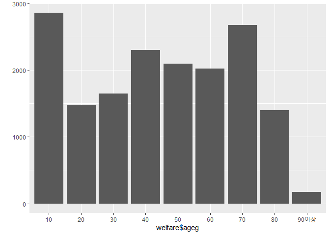

연령대에 따른 월급 차이
================
하현주
July 31, 2020

## 4\. 연령대에 따른 월급 차이

### 분석 절차

변수 검토 및 전처리 -연령대 -월급

변수 간 관계 분석 -연령대별 월급 평균표 만들기 -그래프 만들기

``` r
welfare$age <-2015 - welfare$birth +1
```

### 연령대 변수 검토 및 전처리하기

#### 1\. 파생변수 만들기 - 연령대

나이 변수를 이용해 연령대 변수 만들기 10,20,30,40,50,60,70,80,대로 세분화할 것.

초년(30세 미만), 중년(30\~59세), 노년(60세 이상)

``` r
welfare<-welfare %>% 
  mutate(ageg=ifelse(age < 20, "10", ifelse(age < 30, "20", ifelse(age<40, "30", ifelse(age<50, "40", ifelse(age<60, "50", ifelse(age<70,"60", ifelse(age<80,"70",ifelse(age<90,"80", "90이상")))))))))

table(welfare$ageg)

qplot(welfare$ageg)
```

<!-- -->

### 연령대에 따른 월급 차이 분석하기

#### 1\. 연령대별 월급 평균표 만들기

``` r
ageg_income <- welfare %>%
 filter(!is.na(income)) %>%
 group_by(ageg) %>%
 summarise(mean_income = mean(income))
```

    ## `summarise()` ungrouping output (override with `.groups` argument)

``` r
ageg_income  
```

#### 2\. 그래프 만들기

``` r
ggplot(data=ageg_income, aes(x=ageg, y=mean_income))+geom_col()
```

<!-- -->

#### 막대 정렬 : 초년, 중년, 노년 나이 순

초년, 중년, 노년 나이 순으로 정렬되도록 scale\_x\_discrete(limit=c())에 범주 순서를 지정함.

``` r
ggplot(data=ageg_income, aes(x=ageg, y=mean_income))+
  geom_col()+
  scale_x_discrete(limits=c("young", "middle", "old"))
```

    ## Warning: Removed 7 rows containing missing values (position_stack).

<!-- -->

표와 그래프를 보면 중년이 280만원 정도로 가장 많은 월급을 받고, 그 다음은 초년이 163만원, 노년이 125만원으로 가장
낮은 월급을 받는다.
