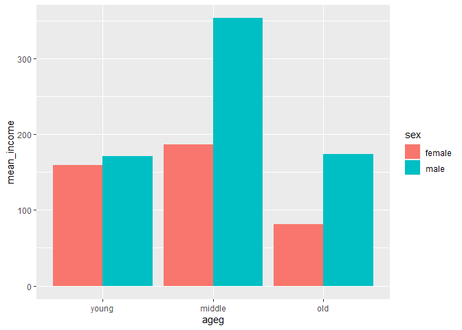

연령대 및 성별 월급 차이
================
하현주
July 31, 2020

## 5\. 연령대 및 성별 월급 차이

### 분석 절차

변수 검토 및 전처리 -연령대 /성별 / 월급

변수 간 관계 분석 -연령대 및 성별 월급 평균표 만들기 / 그래프 만들기

### 연령대 및 성별 월급 차이 분석하기

연령대, 성별, 월급 변수 앞에서 전처리 작업한 결과 토대로 성별 월급차이가 연령대에 따라 다른지 분석하기

#### 1\. 연령대 및 성별 월급 평균표 만들기

``` r
sex_income <-welfare %>% 
  filter(!is.na(income)) %>% 
  group_by(ageg, sex) %>% 
  summarise(mean_income=mean(income))
```

    ## `summarise()` regrouping output by 'ageg' (override with `.groups` argument)

``` r
sex_income
```

#### 2\. 그래프 만들기

x축에 ageg를 지정하여 막대가 연령대별로 표현되도록, 성별에 따라 다른색으로 표현되도록 fill에 sex를 지정. 축 순서는
scale\_x\_discrete(limits=c())를 이용해 연령대순으로 설정

``` r
ggplot(data = sex_income, aes(x = ageg, y = mean_income, fill = sex)) +
 geom_col() +
 scale_x_discrete(limits = c("young", "middle", "old"))
```

<!-- -->

#### 성별 막대 분리

성별의 월급이 연령대 막대에 함께 표현되어 있어 차이를 비교하기 어렵다. geom\_col()의 position파라미터를
“dodge”로 설정하여 막대를 분리

``` r
ggplot(data = sex_income, aes(x = ageg, y = mean_income, fill = sex)) +
 geom_col(position = "dodge") +
 scale_x_discrete(limits = c("young", "middle", "old"))
```

<!-- -->

성별 월급 차이 양상이 초년에는 차이가 크지 않다가 중년에 크게 벌어져 남성이 166만 원가량 더 많음. 노년에는 차이가
줄어들지만 여전히 남성의 월급이 92만 원가량 더 많음.

연령대별 월급을 분석했을 때 노년이 초년보다 적은 월급을 받는 것으로 나타났습니다. 하지만 성별로 나눈 결과를 보면 남성의 경우
노년과 초년간 월급차이가 크지 않다는 것을 알 수 있습니다. 노년이 초년보다 적을 월급을 받는 현상은 여성에게서만 나타나고
있습니다. 또한 초년보다 중년이 더 많은 월급을 받는 현상도 주로 남성에게서 나타나고, 여성은 큰 차이가 없다는 것을 알
수 있습니다.

### 나이 및 성별 월급 차이 분석하기

선 그래프로 만들고, 월급 평균 선이 성별에 따라 다른색으로 표현되도록 aes()의 col파라미터에 sex를 지정하겠습니다.

``` r
#성별 연령별 월급 평균표 만들기
sex_age <- welfare %>%
 filter(!is.na(income)) %>%
 group_by(age, sex) %>%
 summarise(mean_income = mean(income))
```

    ## `summarise()` regrouping output by 'age' (override with `.groups` argument)

``` r
head(sex_age)
```

#### 그래프 만들기

``` r
ggplot(data=sex_age, aes(x=age, y=mean_income, col=sex)) + geom_line()
```

<!-- -->

남성의 월급은 50세 전후까지 지속적으로 증가하다가 급격하게 감소하는 반면, 여성은 30세 전후까지 약간 상승하다가 그 이후로는
지속적으로 감소한다는 것을 알 수 있음. 성별 월급 격차는 30세부터 지속적으로 벌어져 50대 초반에 가장 크게 벌어지고,
이후로 점차 줄어들어 70대 후반이 되면 비슷한 수준이 됨.
