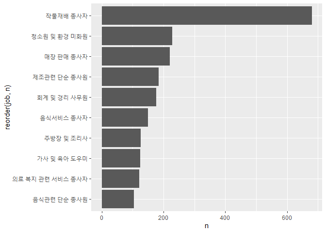

성별 직업 빈도
================
하현주
July 31, 2020

## 7\. 성별 직업 빈도

### 분석 절차

1.  변수 검토 및 전처리 -성별 -직업

2.  변수 간 관계 분석 -성별 직업 빈도 만들기 -그래프 만들기

### 성별 직업 빈도 분석하기

#### 1\. 성별 직업 빈도표 만들기

``` r
#남성 직업 빈도 상위 10개 추출
job_male <-welfare %>% 
  filter(!is.na(job)&sex=="male") %>% 
  group_by(job) %>% 
  summarise(n=n()) %>% 
  arrange(desc(n)) %>% 
  head(10)
```

    ## `summarise()` ungrouping output (override with `.groups` argument)

``` r
job_male

#여성 직업 빈도 상위 10개 추출
job_female <-welfare %>% 
  filter(!is.na(job)&sex=="female") %>% 
  group_by(job) %>% 
  summarise(n=n()) %>% 
  arrange(desc(n)) %>% 
  head(10)
```

    ## `summarise()` ungrouping output (override with `.groups` argument)

``` r
job_female
```

#### 2\. 그래프 만들기

``` r
#남성 직업 빈도 상위 10개 직업
ggplot(data=job_male, aes(x=reorder(job,n), y=n))+
  geom_col()+
  coord_flip()
```

<!-- -->

``` r
#여성 직업 빈도 상위 10개 직업
ggplot(data=job_female, aes(x=reorder(job,n), y=n))+
  geom_col()+
  coord_flip()
```

<!-- -->

출력된 표와 그래프를 보면 남성들이 가장 많이 가지고 있는 직업은 작물 재배 종사자, 자동차 운전원, 경영관련 사무원, 영업
종사자라는 것을 알 수 있음. 여성들이 가장 많이 가지고 있는 직업은 작물재배 종사자, 청소원 및 환경 미화원, 매장
판매 종사자, 제조관련 단순 종사원이라는 것을 알 수 있음.
