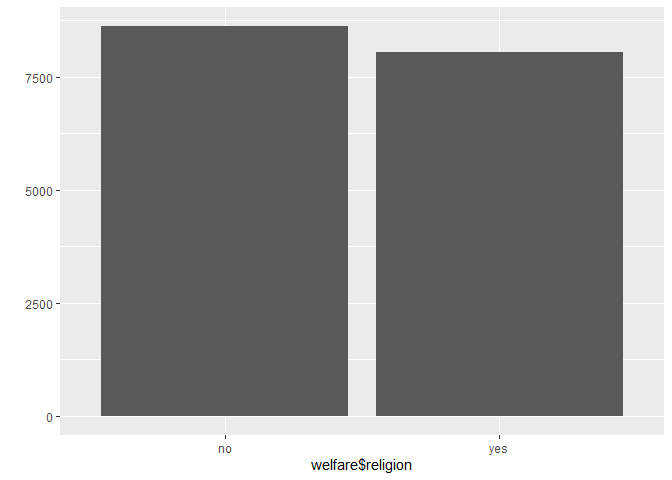

종교 유무에 따른 이혼율
================
하현주
July 31, 2020

## 8\. 종교 유무에 따른 이혼율

### 분석 절차

1.  변수 검토 및 전처리 -종교 -혼인상태

2.  변수 간 관계 분석 -종교 유무에 따른 이혼율 표 만들기 -그래프 만들기

### 종교 변수 검토 및 전처리하기

#### 1\. 변수 검토하기

``` r
class(welfare$religion)
table(welfare$religion)
```

#### 2\. 전처리

코드북의 종교 변수에 대한 정보 바탕으로 전처리 출력 결과를 보면 종교가 있는 사람이 8047명, 종교가 없는 사람이
8617명이라는 것을 알 수 있음.

``` r
welfare$religion <-ifelse(welfare$religion==1, "yes", "no")
table(welfare$religion)
qplot(welfare$religion)
```

<!-- -->

### 혼인 상태 변수 검토 및 전처리하기

#### 1\. 변수 검토하기

배우자가 있을 경우 1, 이혼했을 경우 3으로 코딩되어 있음. 이 값을 이용해 이혼 여부를 나타내는 변수 만들기

``` r
class(welfare$marriage)
table(welfare$marriage)
```

#### 2\. 전처리

``` r
#이혼 여부 변수 만들기
welfare$group_marriage <- ifelse(welfare$marriage==1, "marriage", ifelse(welfare$marriage==3, "divorce", NA))
table(welfare$group_marriage)
table(is.na(welfare$group_marriage))
qplot(welfare$group_marriage)
```

<!-- -->

출력 결과 결혼 상태인 사람은 8431명, 이혼한 사람은 712명 이라는 것을 알 수 있음. 둘 중 어디에도 속하지 않은 사람은
7521명, 이들은 이후 분석에서 제외함.

### 종교 유무에 따른 이혼율 분석하기

#### 1\. 종교 유무에 따른 이혼율 표 만들기

종교 유무 및 결혼 상태별로 나눠 빈도를 구한 뒤 각 종교 유무 집단의 전체빈도로 나눠 비율을 구합니다. 비율은 round()를
이용해 소수점 첫째 자리 까지 표현되도록 함.

``` r
religion_marriage <- welfare %>% 
  filter(!is.na(group_marriage)) %>% 
  group_by(religion, group_marriage) %>% 
  summarise(n=n()) %>% 
  mutate(tot_group=sum(n)) %>% 
  mutate(pct=round(n/tot_group*100, 1))
```

    ## `summarise()` regrouping output by 'religion' (override with `.groups` argument)

``` r
religion_marriage
```

#### `count()` 활용

dplyr의 count()는 집단별 빈도를 구하는 함수. count()를 이용하고, 비율은 구하는 mutate()를 하나로 합쳐서
비율표 만들 수 있음.

``` r
religion_marriage <- welfare %>% 
  filter(!is.na(group_marriage)) %>% 
  count(religion, group_marriage) %>% 
  group_by(religion) %>%  
  mutate(pct=round(n/sum(n)*100, 1))
```

#### 2\. 이혼율 표 만들기

``` r
#이혼 추출
divorce <-religion_marriage %>% 
  filter(group_marriage=="divorce") %>% 
  select(religion, pct)
divorce
```

#### 3\. 그래프 만들기

``` r
ggplot(data=divorce, aes(x=religion, y=pct))+geom_col()
```

<!-- -->

이혼율은 종교가 있는 경우 7.2%, 종교가 없는 경우 8.3%로 나타남. 따라서 종교가 있는 사람들이 이혼을 덜 한다고 볼 수
있음.

### 연령대 및 종교 유무에 따른 이혼율 분석하기

#### 1\. 연령대별 이혼율 표 만들기

``` r
ageg_marriage <- welfare %>% 
  filter(!is.na(group_marriage)) %>% 
  group_by(ageg, group_marriage) %>% 
  summarise(n = n()) %>% 
  mutate(tot_group=sum(n)) %>%
  mutate(pct=round(n/tot_group*100, 1))
```

    ## `summarise()` regrouping output by 'ageg' (override with `.groups` argument)

``` r
ageg_marriage
```

#### `count()` 활용

``` r
ageg_marriage <- welfare %>% 
  filter(!is.na(group_marriage)) %>% 
  count(ageg, group_marriage) %>% 
  group_by(ageg) %>% 
  mutate(pct=round(n/sum(n)*100, 1))
```

이혼율이 연령대별로 다르다는 것을 알 수 있음. 초년의 경우 결혼하거나 이혼한 사례가 적으나, 사례가 부족해 다른 연령대과
비교하기에 적합하지 않아 이후 분석 작업에서 제외.

#### 2\. 연령대별 이혼율 그래프 만들기

``` r
#초년 제외, 이혼 추출
ageg_divorce <- ageg_marriage %>% 
  filter(ageg !="young" & group_marriage=="divorce") %>% 
  select(ageg, pct)
ageg_divorce
#그래프 만들기
ggplot(data=ageg_divorce, aes(x=ageg, y=pct))+geom_col()
```

<!-- -->

노년보다 중년의 이혼율이 높음

#### 3\. 연령대 및 종교 유무에 따른 이혼율 표 만들기

``` r
ageg_religion_marriage <- welfare %>% 
  filter(!is.na(group_marriage)& ageg !="young") %>% 
  group_by(ageg, religion, group_marriage) %>% 
  summarise(n=n()) %>% 
  mutate(tot_group=sum(n)) %>% 
  mutate(pct=round(n/tot_group*100, 1))
```

    ## `summarise()` regrouping output by 'ageg', 'religion' (override with `.groups` argument)

``` r
ageg_religion_marriage
```

#### `count()` 활용

``` r
ageg_religion_marriage <- welfare %>% 
  filter(!is.na(group_marriage)& ageg !="young") %>% 
  count(ageg, religion, group_marriage) %>% 
  group_by(ageg, religion) %>% 
  mutate(pct=round(n/sum(n)*100, 1))
```

#### 연령대 및 종교 유무별 이혼율 표 만들기

``` r
df_divorce <-ageg_religion_marriage %>% 
  filter(group_marriage=="divorce") %>% 
  select(ageg, religion, pct)
df_divorce
```

#### 4\. 연령대 및 종교 유무에 따른 이혼율 그래프 만들기

``` r
ggplot(data=df_divorce, aes(x=ageg, y=pct, fill=religion))+ geom_col(position="dodge")
```

<!-- -->

노년은 종교 유무에 따른 이혼율 차이가 0.1%로 작고, 오히려 종교가 있는 사람들의 이혼율이 더 높다는 것을 알 수 있음.
반면, 중년은 종교가 없는 사람들의 이혼율이 1.8% 더 높다는 것을 알 수 있음.
