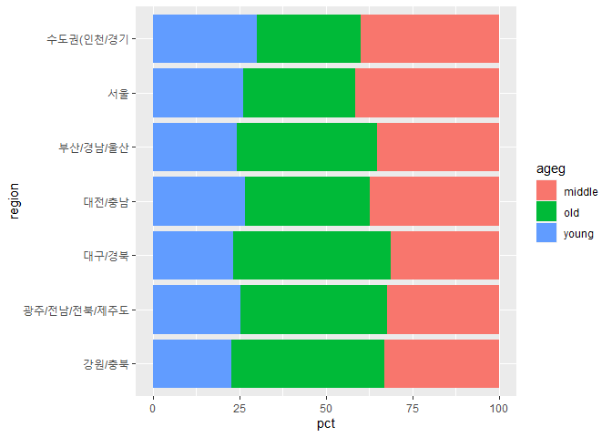
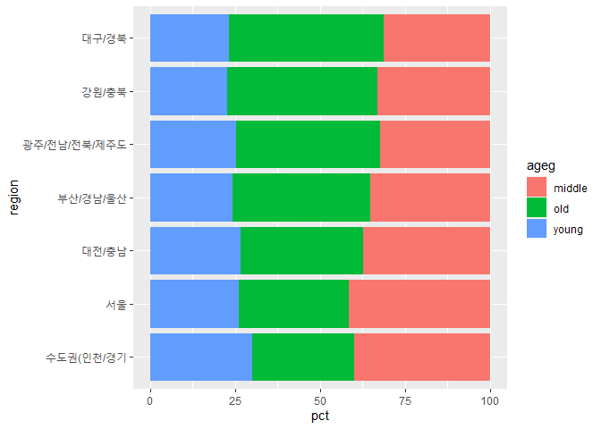
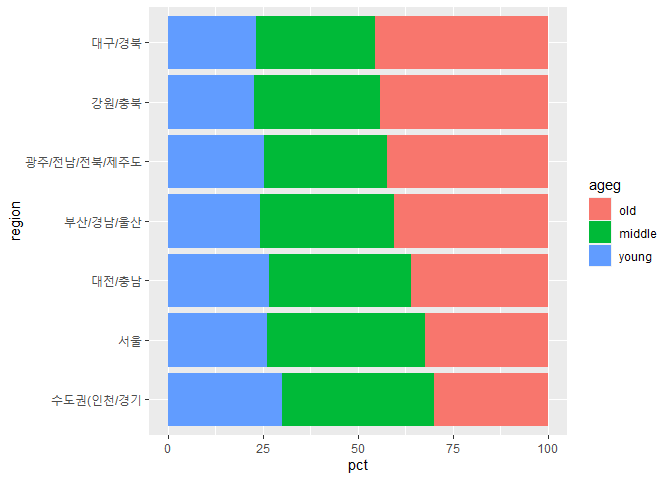

지역별 연령대 비율
================
하현주
July 31, 2020

## 9\. 지역별 연령대 비율

### 분석 절차

1.  변수 검토 및 전처리 -지역 -연령대

2.  변수 간 관계 분석 -지역별 연령대 비율표 만들기 -그래프 만들기

### 지역 변수 검토 및 전처리하기

#### 1\. 변수 검토하기

``` r
class(welfare$code_region)
table(welfare$code_region)
```

#### 2\. 전처리

``` r
#지역 코드 목록 만들기
list_region <- data.frame(code_region=c(1:7), region=c("서울", "수도권(인천/경기", "부산/경남/울산", "대구/경북", "대전/충남", "강원/충북", "광주/전남/전북/제주도"))
list_region
```

#### `welfare`에 지역명 변수 추가

``` r
welfare <-left_join(welfare, list_region, id="code_region")
```

    ## Joining, by = "code_region"

### 지역별 연령대 비율 분석하기

#### 1\. 지역별 연령대 비율표 만들기

``` r
region_ageg <- welfare %>%
 group_by(region, ageg) %>%
 summarise(n = n()) %>%
 mutate(tot_group = sum(n)) %>%
 mutate(pct = round(n/tot_group*100, 2))
```

    ## `summarise()` regrouping output by 'region' (override with `.groups` argument)

``` r
head(region_ageg)
```

#### `count()` 활용

``` r
region_ageg <- welfare %>%
 count(region, ageg) %>%
 group_by(region) %>%
 mutate(pct = round(n/sum(n)*100, 2))
```

#### 2\. 그래프 만들기

``` r
ggplot(data = region_ageg, aes(x = region, y = pct, fill = ageg)) +
 geom_col() +
 coord_flip()
```

<!-- -->

#### 3\. 막대 정렬하기 : 노년층 비율 높은 순

``` r
# 노년층 비율 내림차순 정렬
list_order_old <- region_ageg %>%
 filter(ageg == "old") %>%
 arrange(pct)

list_order_old

# 지역명 순서 변수 만들기
order <- list_order_old$region
order

ggplot(data = region_ageg, aes(x = region, y = pct, fill = ageg)) +
 geom_col() +
 coord_flip() +
 scale_x_discrete(limits = order)
```

<!-- -->

#### 4\. 연령대 순으로 막대 색깔 나열하기

``` r
class(region_ageg$ageg)
levels(region_ageg$ageg)
region_ageg$ageg<-factor(region_ageg$ageg, level=c("old", "middle", "young"))
class(region_ageg$ageg)
levels(region_ageg$ageg)
ggplot(data = region_ageg, aes(x = region, y = pct, fill = ageg)) +
 geom_col() +
 coord_flip() +
 scale_x_discrete(limits = order)
```

<!-- -->
